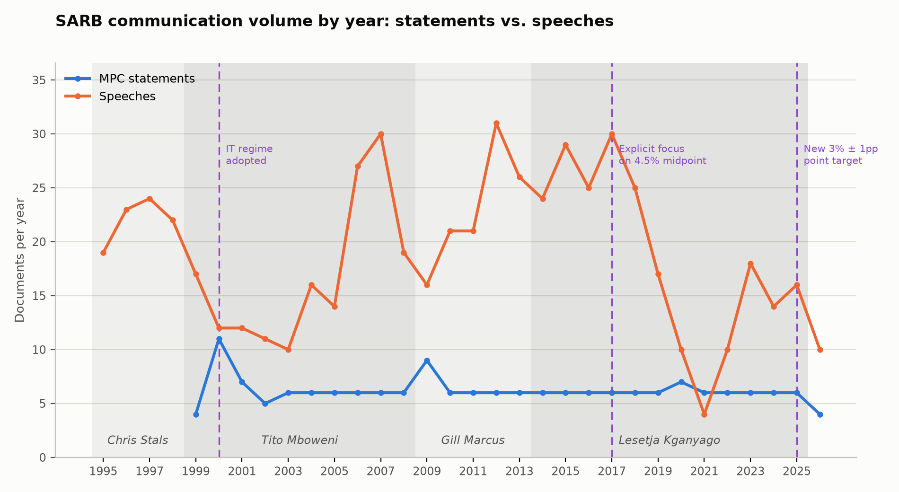
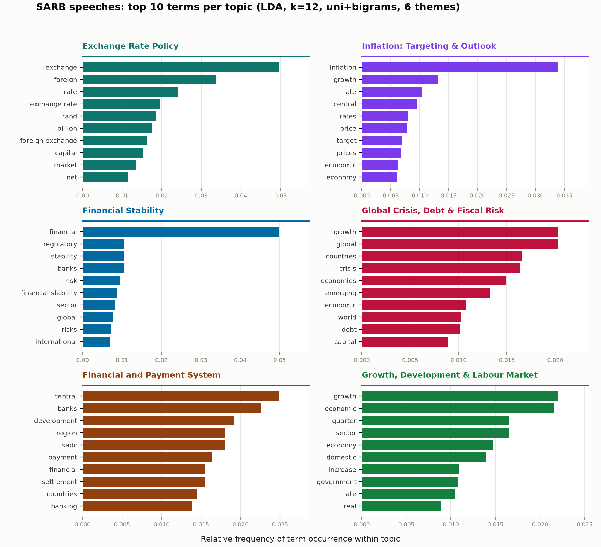
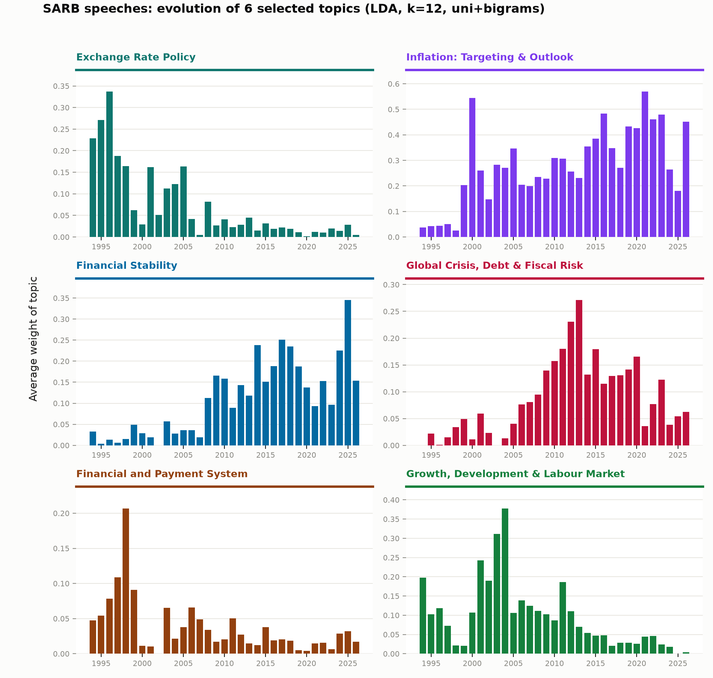

# Reading the SARB Between the Lines

A text-mining pipeline that replicates and updates du Rand, Erasmus, Hollander, Reid &
van Lill (2021), *"The evolution of central bank communication as experienced by the
South African Reserve Bank"* (Economic History of Developing Regions), through the SARB's
own public statements and speeches — extended from the paper's 1994–2020 window through
July 2026.

Full write-up (narrative, charts, discussion): **[link to the published article]**.
Code and data here are what the article's analysis is built on.

## Abstract

We scrape every MPC statement (173, since 1999) and every speech by a Governor or Deputy
Governor (604 on record, 502 usable in English, since 1994) published on resbank.co.za, and
run three analyses on top of that corpus: (1) a communication-volume timeline overlaid with
Governor tenures and inflation-target changes, (2) an LDA topic model over the speeches
(k=12, unigrams + bigrams) recovering six interpretable themes, and (3) a Henry (2008)
dictionary-based hawkish/dovish sentiment index — replicating Erasmus & Hollander (2020) —
computed for statements, speeches, and a per-meeting combined series with an exact
statement-vs-speech contribution decomposition. We close by using that index to check
whether the SARB's 23 July 2026 hold, against a market majority pricing a hike, was
actually unusual given the Bank's own communication history (it wasn't, particularly once
you condition on the cycle position).

## Motivation

This project exists for two reasons. First, the du Rand et al. paper is the best existing
text-mining study of SARB communication, but it stops in 2020 — before the pandemic
response, the fastest hiking cycle of the inflation-targeting era, and a redefinition of
the inflation target itself (November 2025). Second, and more immediately: the SARB's
23 July 2026 MPC meeting held the repo rate at 7.00% when the market consensus was for a
hike. That specific surprise is what motivated pulling this whole pipeline back out — not
to argue what the SARB *should* have done, but to check what its own words say about what
it *tends* to do in similarly hawkish-sounding moments.

## Key results

**1. Communication volume.** Speech volume roughly tripled from the early 2000s to a 2017
peak, then nearly halved by 2019 — before Covid. MPC statement frequency, by contrast, has
been a metronome: six meetings a year, every year, since 1999.



**2. Topic evolution (speeches only).** An LDA topic model (k=12, unigrams + bigrams,
seed=99) recovers six themes with a coherent historical reading: Exchange Rate Policy
(peaks in the 1996 and 2001 rand crises), Financial Stability (structural rise post-2008),
Global Crisis/Debt/Fiscal Risk (a real crisis dial — GFC, Euro debt crisis, Covid),
Inflation: Targeting & Outlook (dominant since the mid-2010s), Growth/Labour Market, and
Financial & Payment System.




**3. Hawkish/dovish index.** A Henry (2008) bag-of-words score, computed three ways
(statements-only, speeches-only, combined-by-meeting). It tracks real policy directionally
(mean +0.78 for hikes, +0.64 for holds, +0.39 for cuts) but runs hot overall — speeches
score +0.76 on average against +0.50 for statements, a persistent gap the original paper's
version shares.

Interactive charts (point cloud + LOWESS smoothing + confidence band, in the paper's
visual style): [`reports/final_05_combined_full.html`](reports/final_05_combined_full.html)
(combined index) and [`reports/final_07_contribution_full.html`](reports/final_07_contribution_full.html)
(statement vs. speech contribution by meeting). Open these directly in a browser — GitHub's
file preview renders raw HTML as text, not as a page.

**4. The July 2026 check.** Going into the 23 July 2026 meeting, market pricing was for a
hike against a backdrop of a US-Iran-conflict energy price shock. Meetings with a combined
index within 0.05 of July 2026's reading (+0.78) have historically held 52% of the time and
hiked only 19%. Narrowed to meetings that, like July 2026, immediately followed a hike,
it's closer to a coin flip (60% hiked again, 40% held) — the index alone doesn't clearly
call whether a hiking cycle continues or pauses. Full table and discussion in the article.

**5. Statements predict the decision better than speeches do.** Scored separately (no
pooling) from the start of inflation targeting (Feb 2000), the statement's own tone
correlates with the announced rate move at r=0.46 (Pearson, vs. the bps change), with a
clean hike/hold/cut ladder (0.76 / 0.50 / 0.19). The tone of speeches in the weeks *before*
a meeting correlates far more weakly with what that meeting decides (r=0.14, ladder
0.70 / 0.66 / 0.61 — directionally right, barely separated). See
[`scripts/build_speech_statement_correlation.py`](scripts/build_speech_statement_correlation.py).

## Methodology summary

| | This project |
|---|---|
| Corpus | 173 MPC statements (1999–2026) + 502 English-language speeches (1994–2026), scraped from resbank.co.za |
| Rate decisions | Cross-validated against an official daily SARB Policy Rate series, not just regex over the statement text |
| Topic model | LDA (`scikit-learn`), k=12, unigrams + bigrams, `min_df=40`, seed=99 — see [`scripts/topic_modeling_lda.py`](scripts/topic_modeling_lda.py) for the full calibration history (why k=12, why bigrams, why a token-cleanup step) |
| Sentiment (primary) | Henry (2008) dictionary bag-of-words, `index = 2 × (hawkish − dovish) / (hawkish + dovish)`, replicating Erasmus & Hollander (2020) — see [`scripts/lexicon_henry.py`](scripts/lexicon_henry.py) / [`scripts/score_henry.py`](scripts/score_henry.py) |
| Sentiment (exploratory, not used in final results) | A hand-built weighted-phrase lexicon ([`scripts/score_lexicon.py`](scripts/score_lexicon.py)) and a scaffolded but not-yet-run LLM classifier ([`scripts/score_llm.py`](scripts/score_llm.py)) — see Roadmap |
| Combined index | Per MPC meeting, not per year: every speech is assigned to the window `(previous meeting, this meeting]`, and `combined = contribution from the statement + contribution from that window's speeches` — an exact decomposition, not an average |

## Repository structure

```
sarb_hawkish_dove/
├── README.md
├── requirements.txt
├── notebook.ipynb                 narrated, reproducible walkthrough of the full pipeline
├── charts/                        static PNGs referenced by this README
├── reports/                       8 interactive HTML charts (statements/speeches/combined/contribution × full+zoom)
├── data/
│   ├── raw/                       scraped indices + the official policy-rate series
│   ├── raw_texts/                 full text of every statement and speech, for manual audit
│   └── processed/                 consolidated datasets, scores, topic model outputs
└── scripts/
    ├── config.py                  shared paths/constants
    ├── fetch_statement_list.py    → data/raw/statements_index.json
    ├── scrape_statements.py       → data/raw_texts/*.txt + statements_dataset.(json|csv)
    ├── fetch_speech_list.py       → data/raw/speeches_index.json
    ├── scrape_speeches.py         → data/raw_texts/speeches/*.txt + speeches_dataset.(json|csv)
    ├── scrape_common.py           shared HTML/PDF extraction (3 site template eras)
    ├── parsers.py                 regex extraction of rate decisions/votes
    ├── build_rate_from_series.py  cross-validates rate_action_final against the official series
    ├── detect_language.py         flags non-English (translated) speeches
    ├── flag_non_english.py        writes the is_english field into both datasets
    ├── lexicon_henry.py           Henry (2008) word lists, transcribed from the paper
    ├── score_henry.py             Henry index for statements
    ├── score_speeches.py          Henry (+ legacy lexicon) index for speeches
    ├── build_combined_index.py    per-meeting combined index + contribution decomposition
    ├── topic_modeling_lda.py      LDA topic model (k=12, bigrams) over speeches
    ├── build_topic_evolution_bars.py   Figure-7-style chart (evolution by year)
    ├── build_topic_words_bars.py       Figure-6-style chart (top terms per topic)
    ├── build_final_charts.py           interactive statements/speeches/combined charts
    ├── build_final_contribution_charts.py  interactive contribution-decomposition charts
    ├── build_speech_statement_correlation.py  statements vs. speeches vs. the decision (Appendix)
    │
    ├── score_lexicon.py, lexicon_terms.py, score_topics.py, topics_lexicon.py,
    │   enrich_macro.py, reparse_rates.py, run_pipeline.py    early-stage / superseded
    │   scripts, kept for history — see Roadmap, not part of the published results
    └── score_llm.py               scaffolded LLM scorer, not yet run — see Roadmap
```

## Installation & usage

```bash
pip install -r requirements.txt
cd scripts

# 1. Collect the corpus (statements + speeches)
python fetch_statement_list.py
python scrape_statements.py
python fetch_speech_list.py
python scrape_speeches.py          # resumable: safe to interrupt and re-run

# 2. Cross-validate rate decisions against the official policy-rate series
python build_rate_from_series.py

# 3. Flag non-English (translated) speeches
python detect_language.py
python flag_non_english.py

# 4. Sentiment scoring (Henry 2008)
python score_henry.py
python score_speeches.py
python build_combined_index.py

# 5. Topic modelling (speeches only)
python topic_modeling_lda.py
python build_topic_evolution_bars.py
python build_topic_words_bars.py

# 6. Final interactive charts
python build_final_charts.py
python build_final_contribution_charts.py

# 7. Appendix: statements vs. speeches vs. the decision itself
python build_speech_statement_correlation.py
```

Or open [`notebook.ipynb`](notebook.ipynb) for the same pipeline with narrated markdown
cells explaining each step, run end-to-end from the already-scraped data in `data/`
(re-running steps 1 hits the live SARB site and can take a while; everything from step 2
onward runs in seconds against the checked-in data).

**Caution:** `scrape_statements.py` overwrites the entire statements dataset on every run
(it is not incremental) — a bare `python scrape_statements.py <N>` smoke test with a small
`N` will truncate the full dataset. `scrape_speeches.py` is resumable/incremental (merges
by URL) and safe to interrupt.

## Methodology & AI Usage

This project was built with Claude (Anthropic) as an active collaborator throughout, not
just for drafting text. In the interest of being upfront about that:

- **Scraping & data engineering**: Claude wrote and iteratively debugged the scraper
  (reverse-engineering the SARB site's internal Solr search API, handling three different
  page templates across 27 years, PDF text extraction). Several real bugs were found and
  fixed this way mid-project — a PDF-selection heuristic that grabbed the wrong attachment
  for 10 statements, a meeting-date error in the SARB's own index metadata, a doubled-letter
  PDF-extraction artifact affecting 2 speeches, and 9 non-English translated speeches that
  were silently contaminating both the sentiment scores and the topic model before being
  identified and filtered.
- **Methodology replication**: the Henry (2008) word lists and the LDA preprocessing
  (rare-term cutoff, `min_df`) were transcribed and interpreted directly from the du Rand
  et al. (2021) paper and its cited sources, with one explicit judgment call flagged in the
  code and the article: the paper's text says terms are trimmed if they occur in "at least
  50%" of documents, but the corpus-size arithmetic it reports (22,552 → 13,697 terms) is
  only consistent with an *absolute* document-count cutoff — read as a likely typo, not
  taken as a silent assumption.
- **Model calibration**: the choice of k=12 topics (vs. the paper's k=6) and the decision to
  merge two topic pairs back together (inflation targeting vs. outlook; two crisis-flavoured
  topics) came from an iterative, human-directed process of testing configurations across
  multiple random seeds and inspecting whether specific thematic separations were stable —
  documented in full in the docstring of `topic_modeling_lda.py` and in the article's
  Section 2, including the dead ends (k=15 was too granular; k=10 made Financial Stability
  and Global Crisis unstable across seeds).
- **Sentiment scoring**: no LLM judgment is involved in the primary (Henry 2008) results —
  it's a fixed dictionary and arithmetic. A prototype LLM-based scorer exists
  (`score_llm.py`) but has not been run or validated; it is documented as a roadmap item,
  not a completed comparison.
- **Writing**: the accompanying article's prose, and this README, were drafted by Claude
  from the verified results and revised interactively; every number quoted in either was
  checked against the underlying CSVs before being kept, and several inconsistencies caught
  in that process (a duplicated sentence, an unexplained figure discrepancy) were corrected
  before publication.

## Known limitations

- Henry (2008) was built for equity-analyst earnings calls, not central-bank text; the
  hawkish skew documented in the article (every rate-action bucket reads net-positive) is
  most likely a property of that mismatch, not a bug in this implementation — the original
  paper's version of the index shows the same skew, if anything more pronounced.
- Rate-decision regex extraction (`parsers.py`) covers the SARB's common phrasing but isn't
  100% reliable on unusually worded statements; `rate_raw_sentence` / `vote_raw_sentence`
  are kept in the dataset for manual spot-checking.
- The official daily policy-rate series used for cross-validation starts in January 2002;
  the ~18 meetings between the 2000 adoption of inflation targeting and that date fall back
  to regex-only extraction (flagged via `rate_source_final`).
- Speech volume totals include 604 speeches on record, but only 511 could be scraped
  (93 are dead links / undigitised pages on the SARB's own site) and only 502 of those are
  in English (9 are translations of the same speeches into isiXhosa, isiZulu, or Xitsonga,
  excluded to avoid double-counting). Those 93 failures are not spread evenly — 54% of them
  (50 of 93) fall in 2002-2006 alone, against a background failure rate under 10% everywhere
  else, so the dip visible in the speeches line over that stretch of `communication-volume.png`
  is mostly an archival gap on the SARB's own site, not a real drop in speaking activity:

  | Year | Indexed | Scraped OK | Failed |
  |---|---|---|---|
  | 2000 | 12 | 7 | 5 |
  | 2001 | 12 | 8 | 4 |
  | 2002 | 11 | 2 | 9 |
  | 2003 | 10 | 1 | 9 |
  | 2004 | 16 | 3 | 13 |
  | 2005 | 14 | 5 | 9 |
  | 2006 | 27 | 17 | 10 |

  Treat the speeches line as a lower bound for that period, not a measurement.

## Roadmap

- Run and validate the scaffolded LLM scorer (`score_llm.py`) as a second, independent
  sentiment method, and compare it systematically against the Henry (2008) results.
- Retire or clearly archive the superseded early-stage scripts (`score_lexicon.py`,
  `score_topics.py`, `enrich_macro.py`, `run_pipeline.py`) rather than leaving them
  alongside the current pipeline.
- Add the script that generates `charts/communication-volume.png` to `scripts/` (it
  currently exists only as the rendered PNG from an earlier exploratory pass).
- Extend the pipeline to other central banks (Fed, ECB, BCB) behind a shared interface.

## Citation

If you use this code or data, please cite the original paper this project replicates and
extends:

> Gideon du Rand, Ruan Erasmus, Hylton Hollander, Monique Reid & Dawie van Lill (2021) The
> evolution of central bank communication as experienced by the South Africa Reserve Bank,
> *Economic History of Developing Regions*, 36:2, 282-312, DOI: 10.1080/20780389.2021.192510

and, for the sentiment dictionary:

> Henry, E. (2008). Are Investors Influenced By How Earnings Press Releases Are Written?
> *Journal of Business Communication*, 45(4).
